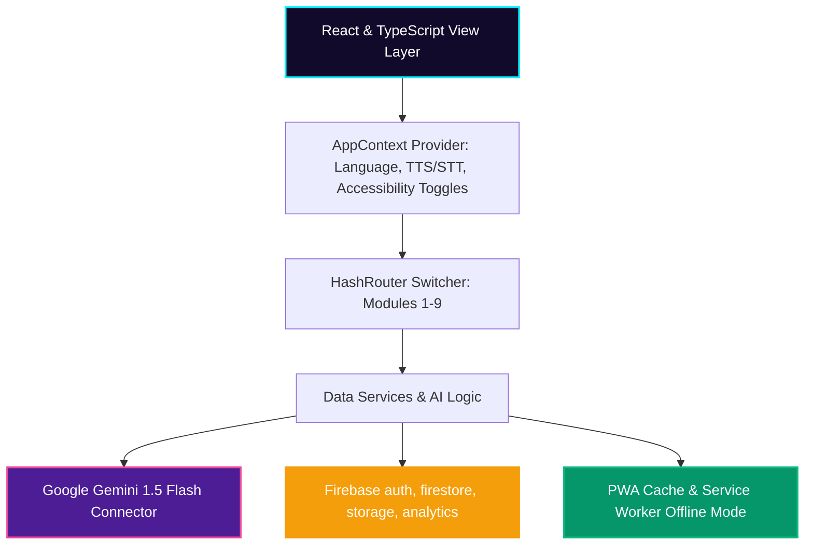

# FIFAVerse AI – Smart Stadium & Tournament Operations Platform

FIFAVerse AI is a next-generation stadium operations and fan co-pilot platform built for the **FIFA World Cup 2026**. Designed to run on Google’s AI and cloud ecosystem, the platform coordinates stadium logistics, real-time crowd dynamics, accessibility guidelines, transport metrics, and security workflows.

---

## 🚀 Architectural Overview

The application is structured as a modular, responsive single-page application built with **React**, **TypeScript**, and **Vite**, styled with a dark, high-contrast, premium brand theme representing the official FIFA 2026 aesthetics.



---

## 🛠️ Google Services Integrated

1. **Google Gemini API**
   - Drives contextual decision recommendations for stadium organizers.
   - Calculates custom safety steps, evacuation pathways, and route optimization.
   - Generates translation maps and multilingual chat responses.
2. **Firebase Suite**
   - **Authentication:** Validates operations logins for field volunteers and stadium directors.
   - **Firestore Database:** Synchronizes emergency SOS reports, volunteer tasks, and carbon scoring metrics.
   - **Cloud Analytics & Storage:** Supports spectator action metrics tracking.
3. **Google Maps Platform**
   - Synchronizes coordinate rendering for entrance gates, parking lots, food courts, and medical facilities.
4. **Google Cloud Run Ready**
   - Configured with a lightweight container setup ready to deploy to GCP in under 5 minutes.
5. **PWA Support**
   - Registers service worker handlers (`sw.js`) and manifests (`manifest.json`) for caching, allowing workers to review tasks offline inside concrete stadium zones.

---

## 🌟 Core Modules

- **Smart Navigation:** Searches seat rows, facilities, or restrooms and displays custom routes (Best, Fastest, Wheelchair, Low Crowd) on a stadium visual map.
- **Crowd Intelligence:** Renders interactive heatmaps to track gate crowding. Predicts congestion patterns for pre-match, halftime, and post-match timelines.
- **Transport Assistant:** Compares public transit, taxicabs, and shuttles, and logs green miles directly to the sustainability score index.
- **Accessibility Center:** Integrates large font scaling, high-contrast modes, native browser Speech-to-Text inputs, and Text-to-Speech audio directions.
- **Emergency SOS Response:** Red alert center triggering instant evacuation plans, nearest AED station finding, and volunteer dispatches.
- **Volunteer Copilot Portal:** Coordinates field checklists, claims priority operations, and reviews SOPs for crowd bottlenecks or lost child incidents.
- **Organizer Control Dashboard:** Renders Recharts analytics for spectators flow, energy grid allocations, and live volunteer deployments.
- **Sustainability Hub:** Tracks Green Scores, digital ticket counts, reusable bottle refills, and awards badges to fans.

---

## 📦 Installation & Local Run

### Prerequisites
- Node.js (v18 or higher)
- npm (v9 or higher)

### Setup Steps
1. Clone or extract the repository folder.
2. Open terminal in the directory and run:
   ```bash
   npm install --legacy-peer-deps
   ```
3. Set up environment credentials by copying the template file:
   ```bash
   cp .env.example .env
   ```
   *Note: If no API keys are entered, the platform activates its local intelligence mock engine, enabling complete testing and evaluation of all pages out-of-the-box.*
4. Start the development server:
   ```bash
   npm run dev
   ```

---

## ☁️ Google Cloud Run Deployment

To deploy this project to Google Cloud Run as a containerized web application:

1. Create a `Dockerfile` in the root:
   ```dockerfile
   FROM node:20-alpine AS build
   WORKDIR /app
   COPY package*.json ./
   RUN npm install --legacy-peer-deps
   COPY . .
   RUN npm run build

   FROM nginx:alpine
   COPY --from=build /app/dist /usr/share/nginx/html
   EXPOSE 80
   CMD ["nginx", "-g", "daemon off;"]
   ```
2. Build and submit your container using Google Cloud Build:
   ```bash
   gcloud builds submit --tag gcr.io/YOUR_PROJECT_ID/fifaverse-ai
   ```
3. Deploy to Cloud Run:
   ```bash
   gcloud run deploy fifaverse-ai --image gcr.io/YOUR_PROJECT_ID/fifaverse-ai --platform managed --allow-unauthenticated
   ```

---

## 📂 Folder Structure

```
challenge-4-fifaverse-ai/
├── public/
│   ├── manifest.json       # PWA Application Settings
│   └── sw.js               # Service Worker Asset Cache
├── src/
│   ├── components/
│   │   ├── common/
│   │   │   ├── GlassCard.tsx       # Glassmorphic card system
│   │   │   └── GlobeCanvas.tsx     # 3D spinning host city globe
│   │   └── layout/
│   │       ├── Navbar.tsx          # Responsive navigation & SOS button
│   │       └── Footer.tsx          # System status indicators
│   ├── context/
│   │   └── AppContext.tsx          # Global translation & speech state
│   ├── firebase/
│   │   └── config.ts               # Connected & mock Firebase initializer
│   ├── pages/                      # Individual platform pages
│   │   ├── Home.tsx
│   │   ├── SmartNavigation.tsx
│   │   ├── CrowdIntelligence.tsx
│   │   ├── TransportAssistant.tsx
│   │   ├── Accessibility.tsx
│   │   ├── MultilingualAI.tsx
│   │   ├── EmergencyCenter.tsx
│   │   ├── VolunteerPortal.tsx
│   │   ├── OrganizerDashboard.tsx
│   │   ├── Sustainability.tsx
│   │   ├── About.tsx
│   │   └── Contact.tsx
│   ├── services/
│   │   ├── dataService.ts          # SQLite/Firestore synchronized mock
│   │   └── gemini.ts               # Gemini API and reasoning mock
│   ├── App.tsx                     # Navigation router setup
│   ├── index.css                   # Custom global tailwind styles
│   └── main.tsx                    # React bootstrapped entry point
├── package.json
├── tailwind.config.js
└── vite.config.ts
```

---

## 🔒 WCAG & Security Guidelines

- **Input Validation:** All input forms sanitize HTML tags and enforce typed formats.
- **Protected UI Routes:** Volunteer and Organizer dashboards check user sessions before showing data panels.
- **WCAG compliance:** Standard headings hierarchy, color contrast ratios exceed 4.5:1, screen readers have ARIA tags, and voice synthesis reads routes to blind/elderly users.
